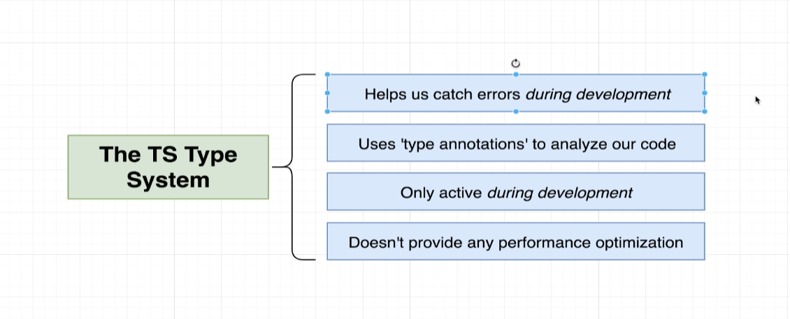
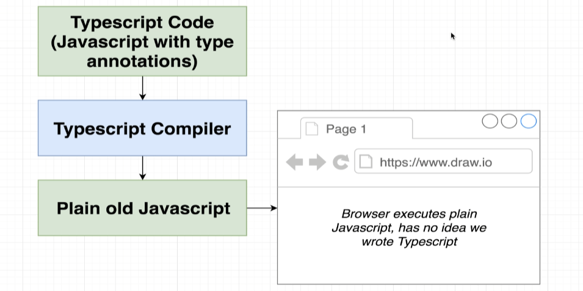
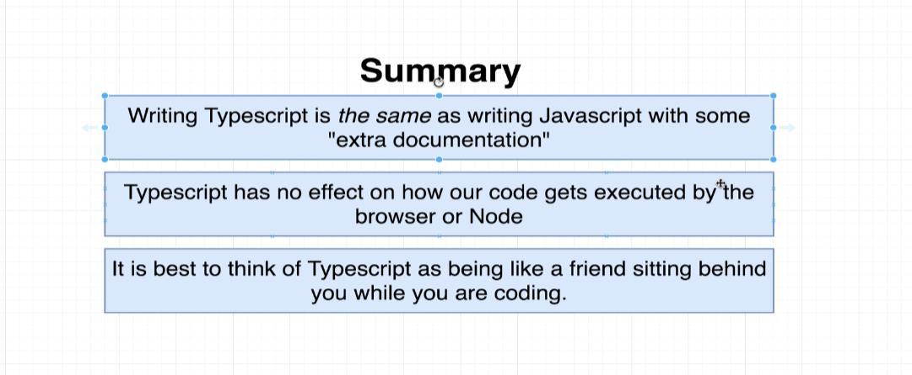
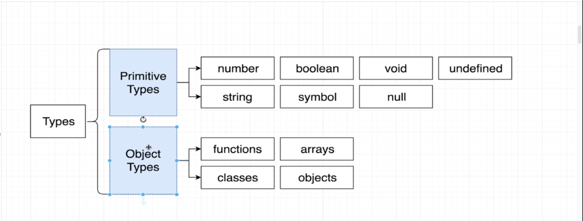
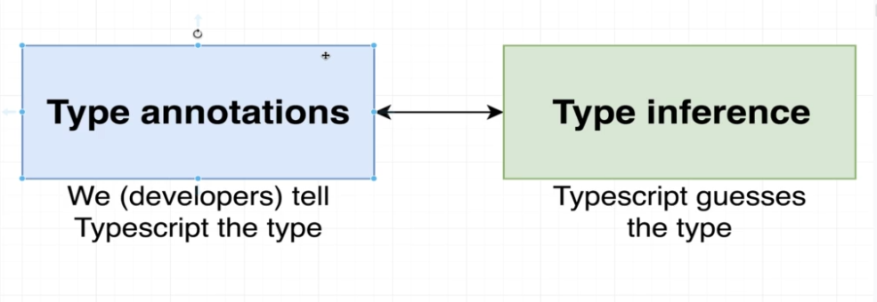
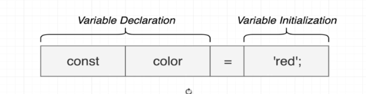
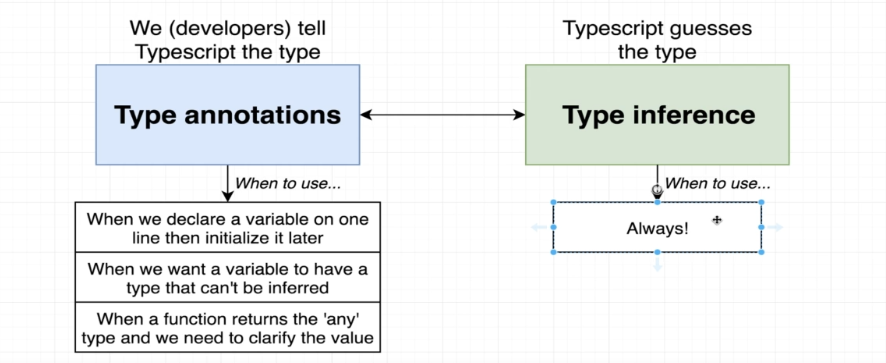
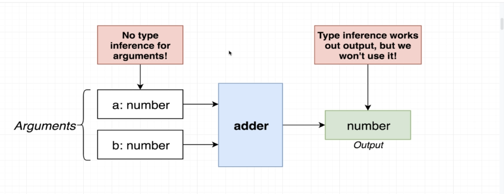

# What's TypeScript?

TypeScript = JavaScript + A Type System



- 'type annotations' : comments to tell us how it works





## Purpose of Typescript

- Help us find the errors during development

## Type System

- Type: Easy way to refer to the different properties + functions that a value has



### Why do we need type?

- Types are used by the TS Compiler to analyze our code for errors
- Types allow other engineers to understand what values are flowing around our codebase

### Where do we use types?

- Everywhere!

# Type Annotations and Inference

- Type annotations: Code we add to tell Typescript what type of value a variable will refer to
- Type inference: Typescript tries to figure out what type of value a variable refers to



## Type Inference



- If declaration and initialization are on the same line, Typescript will figure out the type of 'color' for us.

```js
const color = 5; //typescript: color: number

let color;
color = 5; // not on the same line so Typescript -> color: any
```

## When to use Type annotations and inference



### Type: any

- any: a type, just as 'string' or 'boolean' are
  - Means TS has no idea what this is - can't check for correct property references
- **Avoid variables with 'any' at all costs**

```js
const json = '{"X": 10, "y":20}';
const cordinates = JSON.parse(json); // type: any
```

### Function



- always use annotations for function. Because if we make a mistake (ex: not return anything in the function), Typescript will asume its a void value and doesn't show any errors.

## For variables, We want to rely on type inference as much as possible except 3 cases:

- function that returns the 'any' type
- When we declare a variable on one line and initialize it later
- variable whose type cannot be inferred correctly

# Arrays

- Typed Arrays: Arrays where each element is some consistent type of value

### Why do we care about array?

- TS can do type inference when extracting values from an array
- TS can prevent us from adding incompatible values to the array
- We can get help with 'map','forEach', 'reduce' functions
- Flexible - arrays can still contain multiple different types
